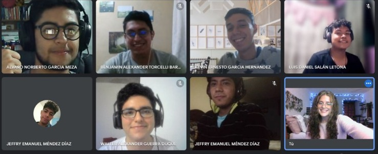

# Informe 2 | Instalación de ubuntu y configuración de redes cableadas e inalambricas
## Grupo 8 - Prácticas Iniciales - Sección F-

Integrantes                     | Carnet
--------------------------------|------------
Aída Alejandra Mansilla Orantes | 202100239 
Alvaro Norberto García Meza     | 202109567
Benjamin Alexander Torcelli Barrios| 201901803
Kevin Ernesto García Hérnandez| 202113553
Luis Daniel Salán Letona | 202000549
                                                      
                    
Tutores | Carnet 
---------|--------------
Walter Guerra | 201709073
Jeffry Méndez | 201901557

## Foto de los integrantes 

# Contenido

Documentos
    <ul>
       <li><a href="https://github.com/AlvaroG13191704/P.I_Informe_2/blob/main/TRIFOLIAR%20VIDEO%201.pdf" target="_blank">:arrow_right: Trifoliar 1</a></li>
       <li><a href="https://github.com/AlvaroG13191704/P.I_Informe_2/blob/main/TRIFOLIAR%20VIDEO%202.pdf">:arrow_right: Trifoliar 2</a></li>
    </ul>
    
## Video 1

## Video 2

